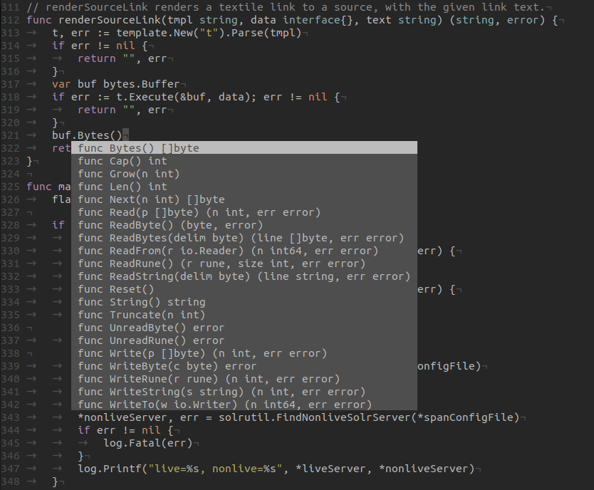
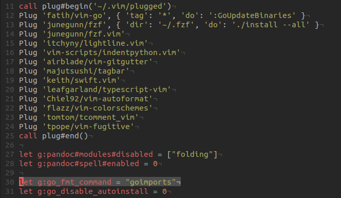

# Editors

An editor is typically enough to write Golang.

* https://golang.org/doc/editors.html

For [vim](https://github.com/fatih/vim-go),
[vscode](https://code.visualstudio.com/docs/languages/go),
[Intellij](https://www.jetbrains.com/go) or
[Atom](https://atom.io/packages/go-plus) there are plugins.

Example completion:

Automatically update imports on save with
[goimports](https://godoc.org/golang.org/x/tools/cmd/goimports).

There are many more features available, such as
[navigation](https://code.visualstudio.com/docs/languages/go#_code-navigation),
support for [testing](https://code.visualstudio.com/docs/languages/go#_test),
[gorename](https://godoc.org/golang.org/x/tools/cmd/gorename) and more.

Much of the functionality wrapped into editor plugins is available as
standalong tools. Golang has been created with tools in mind.
