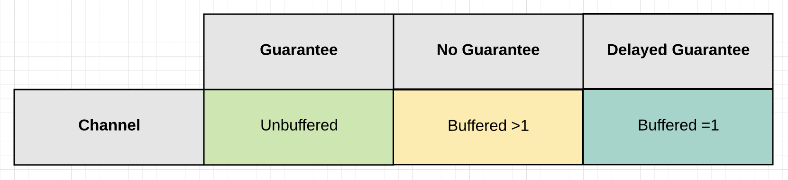

## Channels
Channels allow goroutines to communicate with each other through the use of signaling semantics. Channels accomplish this signaling through the use of sending/receiving data or by identifying state changes on individual channels. Don't architect software with the idea of channels being a queue, focus on signaling and the semantics that simplify the orchestration required.

## Design Guidelines

### Channel Design

Channels allow goroutines to communicate with each other through the use of signaling semantics. Channels accomplish this signaling through the use of sending/receiving data or by identifying state changes on individual channels. Don't architect software with the idea of channels being a queue, focus on signaling and the semantics that simplify the orchestration required.

**Language Mechanics:**

* Use channels to orchestrate and coordinate goroutines.
    * Focus on the signaling semantics and not the sharing of data.
    * Signaling with data or without data.
    * Question their use for synchronizing access to shared state.
        * _There are cases where channels can be simpler for this but initially question._
* Unbuffered channels:
    * Receive happens before the Send.
    * Benefit: 100% guarantee the signal being sent has been received.
    * Cost: Unknown latency on when the signal will be received.
* Buffered channels:
    * Send happens before the Receive.
    * Benefit: Reduce blocking latency between signaling.
    * Cost: No guarantee when the signal being sent has been received.
        * The larger the buffer, the less guarantee.
        * Buffer of 1 can give you one delayed send of guarantee.
* Closing channels:
    * Close happens before the Receive. (like Buffered)
    * Signaling without data.
    * Perfect for signaling cancellations and deadlines.
* NIL channels:
    * Send and Receive block.
    * Turn off signaling
    * Perfect for rate limiting or short-term stoppages.

**Design Philosophy:**

Depending on the problem you are solving, you may require different channel semantics. Depending on the semantics you need, different architectural choices must be taken.

* If any given Send on a channel `CAN` cause the sending goroutine to block:
    * Be careful with Buffered channels larger than 1.
        * Buffers larger than 1 must have reason/measurements.
    * Must know what happens when the sending goroutine blocks.
* If any given Send on a channel `WON'T` cause the sending goroutine to block:
    * You have the exact number of buffers for each send.
        * Fan Out pattern
    * You have the buffer measured for max capacity.
        * Drop pattern
* Less is more with buffers.
    * Don’t think about performance when thinking about buffers.
    * Buffers can help to reduce blocking latency between signaling.
        * Reducing blocking latency towards zero does not necessarily mean better throughput.
        * If a buffer of one is giving you good enough throughput then keep it.
        * Question buffers that are larger than one and measure for size.
        * Find the smallest buffer possible that provides good enough throughput.

## Diagrams

### Guarantee Of Delivery

The `Guarantee Of Delivery` is based on one question: “Do I need a guarantee that the signal sent by a particular goroutine has been received?”

### Signaling With Or Without Data

When you are going to signal `with` data, there are three channel configuration options you can choose depending on the type of `guarantee` you need.

Signaling without data serves the main purpose of cancellation. It allows one goroutine to signal another goroutine to cancel what they are doing and move on. Cancellation can be implemented using both `unbuffered` and `buffered` channels.

### State

The behavior of a channel is directly influenced by its current `State`. The state of a channel can be `nil`, `open` or `closed`.

## Links

* [Channel Communication](https://golang.org/ref/mem#tmp_7)
* [Share Memory By Communicating](http://blog.golang.org/share-memory-by-communicating) - Andrew Gerrand
* [The Nature Of Channels In Go](https://www.ardanlabs.com/blog/2014/02/the-nature-of-channels-in-go.html) - William Kennedy
* [A Retrospective on SEDA](http://matt-welsh.blogspot.com/2010/07/retrospective-on-seda.html) - Matt Welsh
* [Understanding Channels](https://www.youtube.com/watch?v=KBZlN0izeiY) - Kavya Joshi

## Code Review

* [Basic mechanics](example1/example1.go) ([Go Playground](https://play.golang.org/p/UY5gai9Ojsm))
* [Tennis game](example2/example2.go) ([Go Playground](https://play.golang.org/p/PvFKD_tNwir))
* [Parallel web crawler](example3/example3.go)

## Advanced Code Review

* [Channel communication ordering](advanced/example1/example1.go) ([Go Playground](https://play.golang.org/p/YwKFJPkB4gC))

## Exercises

### Exercise 1
Write a program where two goroutines pass an integer back and forth ten times. Display when each goroutine receives the integer. Increment the integer with each pass. Once the integer equals ten, terminate the program cleanly.

* [Template](exercises/template1/template1.go) ([Go Playground](https://play.golang.org/p/gv9lxA3qhH-)) |
* [Answer](exercises/exercise1/exercise1.go) ([Go Playground](https://play.golang.org/p/8S685ND54dW))

### Exercise 2 (*)
Write a program that uses a fan out pattern to generate 100 random numbers concurrently. Have each goroutine generate a single random number and return that number to the main goroutine over a buffered channel. Set the size of the buffer channel so no send ever blocks. Don't allocate more buffers than you need. Have the main goroutine display each random number it receives and then terminate the program.

* [Template](exercises/template2/template2.go) ([Go Playground](https://play.golang.org/p/9_b6YcBuSOR)) |
* [Answer](exercises/exercise2/exercise2.go) ([Go Playground](https://play.golang.org/p/cEUYThI5etc))

### Exercise 3
Write a program that generates up to 100 random numbers concurrently. Do not send all 100 values so the number of sends/receives is unknown.

* [Template](exercises/template3/template3.go) ([Go Playground](https://play.golang.org/p/TQMIiAelw5L)) |
* [Answer](exercises/exercise3/exercise3.go) ([Go Playground](https://play.golang.org/p/76xnxU1yL5K))

### Exercise 4 (*)
Write a program that generates up to 100 random numbers concurrently using a worker pool. Reject even values. Instruct the workers to shutdown with 100 odd numbers have been collected.

* [Template](exercises/template4/template4.go) ([Go Playground](https://play.golang.org/p/2EShivwAWlq)) |
* [Answer](exercises/exercise4/exercise4.go) ([Go Playground](https://play.golang.org/p/jUnB-6OpV1Q))
___
All material is licensed under the [Apache License Version 2.0, January 2004](http://www.apache.org/licenses/LICENSE-2.0).
